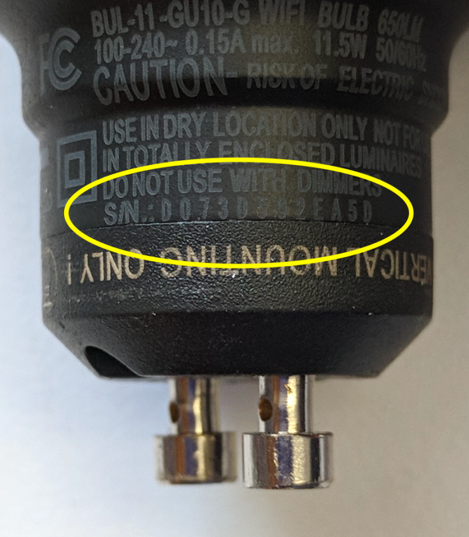

# Controlling LIFX Light Bulbs

[LIFX](https://www.lifx.com/) makes a line of WiFi-connected light bulbs for consumers, in the same market as Philips Hue bulbs. They can be controlled either through LIFX’ portal via a [HTTP REST API](https://api.developer.lifx.com/reference/introduction), or directly on your LAN via a [UDP-based API](https://lan.developer.lifx.com/docs/communicating-with-device). There’s a [good description](https://lan.developer.lifx.com/docs/packet-contents) of how to build up the UDP messages byte-by-byte on their documentation site as well.

## Connecting

If you’re on a consumer network that’s open or uses WPA, you can connect and configure LIFX bulbs through their app for Android or iOS. If you’re on an enterprise network that filters devices by MAC address, you’ll need to know the bulb’s MAC address first. Fortunately, LIFX uses the MAC address as the serial number for the bulb, and you can read it from the bulb’s collar as shown in Figure 1:

## LIFX bulb mac address

When you power the LIFX bulbs for the first time, they show up as a WiFi access point, as “LIFX Bulb-XXXX” where XXXX is the last four hexadecimal digits of the MAC address. To  connect bulbs to a local network, you must first connect to the bulb from your mobile device, then set the credentials for your network via the app. While there are [workarounds for how to configure the bulbs for your network without the app](https://github.com/tserong/lifx-hacks/blob/master/onboard.py), the simplest way is to use the app.

## Resetting the Bulbs

It’s also useful to know how to reset the LIFX bulbs in case you need to reconfigure them for another network. To do this, turn off power to the bulb, then flip the reset switch on the side of the bulb, then turn on power again. The bulb should cycle through red, green, and blue, then settle to white, and you should see it show up as a WiFI access point again on your computer or mobile device. You might have to go through the process twice to make it reset properly.

## Discovering the Bulbs on a Network

Once your bulbs are connected to your local area network, they will respond to discovery messages.

## LIFX Library for Arduino

This repository contains a LIFX library for Arduino. It works on the MKR1000, MKR1010, and Nano 33 IoT, and probably on the ESP boards as well, though I haven’t tested it there. For more, see the [API page](API).